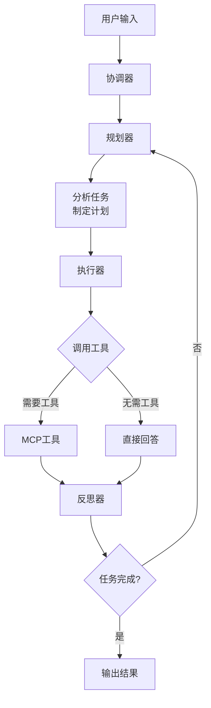

# 🤖 TaskCrew-Lite

[](https://www.python.org/downloads/)
[](https://fastapi.tiangolo.com/)
[](https://langchain.com/)
[](https://opensource.org/licenses/MIT)

> 一个基于 **FastAPI + LangChain + MCP** 的多 Agent 智能体协作系统

TaskCrew-Lite 实现了多 Agent 协作架构，通过规划器(Planner)、执行器(Executor)、反思器(Reflector)的循环配合，让 LLM 能够自主规划、调用工具、反思改进，完成复杂任务。


## ✨ 核心特性

- 🤖 **多 Agent 协作** - 规划器 → 执行器 → 反思器循环工作
- 🔧 **MCP 工具调用** - 支持 Model Context Protocol 标准工具调用
- 🧠 **LangChain Agent** - 使用 LangChain Agent 自动选择和调用工具
- 💾 **OpenAI 格式上下文** - 内存缓存数据库，标准 OpenAI 消息格式
- 📝 **提示词管理** - 动态提示词管理和热更新
- 🌊 **流式输出** - 支持 SSE 流式响应，实时查看思考过程
- 🔒 **安全设计** - API 密钥通过环境变量管理，防止泄露

## 🏗️ 架构概览

```
┌─────────────────────────────────────────────────────────────┐
│                      TaskCrew-Lite                           │
├─────────────────────────────────────────────────────────────┤
│  ┌──────────────┐  ┌──────────────┐  ┌──────────────┐      │
│  │   Planner    │  │   Executor   │  │  Reflector   │      │
│  │   Agent      │  │   Agent      │  │   Agent      │      │
│  └──────┬───────┘  └──────┬───────┘  └──────┬───────┘      │
│         │                 │                 │              │
│         └─────────────────┼─────────────────┘              │
│                           │                                │
│                    ┌──────┴──────┐                        │
│                    │ Orchestrator │                        │
│                    │   Agent      │                        │
│                    └──────┬──────┘                        │
│                           │                                │
├───────────────────────────┼────────────────────────────────┤
│  ┌──────────────┐  ┌──────┴──────┐  ┌──────────────┐      │
│  │   Memory     │  │    MCP      │  │   Prompts    │      │
│  │   Cache      │  │   Tools     │  │   Manager    │      │
│  └──────────────┘  └─────────────┘  └──────────────┘      │
├─────────────────────────────────────────────────────────────┤
│                      FastAPI Server                          │
└─────────────────────────────────────────────────────────────┘
```

## 🚀 快速开始

### 1. 克隆项目

```bash
git clone https://github.com/yourusername/taskcrew-lite.git
cd taskcrew-lite
```

### 2. 安装依赖

```bash
pip install -r requirements.txt
```

### 3. 配置环境变量

```bash
# 复制示例配置文件
cp .env.example .env

# 编辑 .env 文件，填入你的 API 密钥
vim .env
```

`.env` 文件示例：

```env
# 大模型配置
LLM_MODEL=gpt-4o-mini
LLM_BASE_URL=https://api.openai.com/v1
LLM_API_KEY=sk-your-openai-api-key

AGENT_MODEL=gpt-4o-mini
AGENT_BASE_URL=https://api.openai.com/v1
AGENT_API_KEY=sk-your-openai-api-key
```

### 4. 启动服务

```bash
python main.py
```

服务将在 http://localhost:8000 启动

### 5. 访问 API 文档

打开浏览器访问：http://localhost:8000/docs

## 📖 使用示例

### 聊天接口

```bash
# 流式聊天（推荐）
curl -X POST http://localhost:8000/api/v1/chat \
  -H "Content-Type: application/json" \
  -d '{
    "query": "帮我查一下北京天气，然后计算25乘以4的结果",
    "stream": true
  }'
```

输出示例：
```
【规划器工作】
我需要帮用户查询北京天气并计算25×4...

【执行器工作】
🔧 正在调用工具: get_weather
{"city": "北京", "temperature": 25, "condition": "晴"}

🔧 正在调用工具: calculator
{"expression": "25 * 4", "result": 100}

【反思器工作】
任务已完成，已获取北京天气（晴，25°C）和计算结果（100）
```

### 查看可用工具

```bash
curl http://localhost:8000/api/v1/tools
```

### 管理提示词

```bash
# 查看所有提示词
curl http://localhost:8000/api/v1/prompts

# 更新提示词
curl -X PUT http://localhost:8000/api/v1/prompts/executor \
  -H "Content-Type: application/json" \
  -d '{"content": "新的执行器提示词..."}'
```

## 🎯 执行器 (Executor)

TaskCrew-Lite 的执行器基于 **LangChain Agent** 实现，具备以下特性：

### 核心能力

1. **自动工具选择** - LangChain Agent 自动分析需求，选择最合适的工具
2. **智能参数解析** - 从自然语言中自动提取工具参数
3. **流式执行** - 实时输出执行过程和中间结果
4. **错误处理** - 内置错误处理和重试机制
5. **上下文感知** - 基于历史对话上下文进行决策

### 执行流程

- **接收规划** - 获取规划器的执行计划
- **工具调用** - 自动选择并调用 MCP 工具
- **结果处理** - 处理工具返回结果
- **输出响应** - 生成最终执行结果

## 🗺️ 下一步开发计划

### 📊 JSON 执行进度管理（即将开发）

计划为执行器添加基于 JSON 的结构化进度管理功能，实现以下能力：

#### 进度数据结构

```json
{
  "execution_id": "exec_1234567890",
  "total_steps": 3,
  "completed_steps": 2,
  "current_step": "step_2",
  "status": "running",
  "steps": [
    {
      "step_id": "step_1",
      "step_name": "查询天气",
      "status": "completed",
      "tool_name": "get_weather",
      "tool_input": {"city": "北京"},
      "tool_output": {"temperature": 25, "condition": "晴"},
      "start_time": "2024-01-01T10:00:00",
      "end_time": "2024-01-01T10:00:01",
      "reasoning": "调用 get_weather 获取北京天气"
    }
  ],
  "summary": "执行摘要",
  "created_at": "2024-01-01T10:00:00",
  "updated_at": "2024-01-01T10:00:05"
}
```

#### 计划功能

- [ ] **执行进度持久化存储** - 将执行进度保存到文件或数据库
- [ ] **断点续执行** - 支持从断点恢复执行，避免重复工作
- [ ] **执行历史查询** - 查询历史执行记录和结果
- [ ] **可视化执行流程图** - 生成执行流程的可视化图表
- [ ] **执行性能分析** - 分析每个步骤的执行时间和资源消耗
- [ ] **步骤重试机制** - 失败的步骤支持自动重试
- [ ] **执行导出/导入** - 支持导出执行进度为 JSON 文件

#### 技术方案

1. 使用 Pydantic 模型定义 `ExecutionStep` 和 `ExecutionProgress`
2. 在执行器中维护当前执行进度状态
3. 提供 `export_progress_json()` 方法导出进度
4. 集成到内存缓存中，支持按 execution_id 查询
5. 可选：添加文件持久化层，保存执行历史

## 🧩 MCP 工具

内置 4 个模拟工具用于测试：

| 工具名 | 功能 | 示例 |
|--------|------|------|
| `calculator` | 数学计算 | `2 + 2`, `sqrt(16)` |
| `get_weather` | 天气查询 | `北京`, `上海` |
| `web_search` | 网络搜索 | `FastAPI 教程` |
| `query_knowledge` | 知识库查询 | `产品发布流程` |

## 📁 项目结构

```
taskcrew-lite/
├── agents/              # Agent 实现
│   ├── executor.py      # 执行器（核心）
│   └── ...
├── core/                # 核心配置
│   └── config.py
├── mcp_tools/           # MCP 工具
│   ├── server.py        # MCP 服务器
│   └── langchain_tools.py  # LangChain 工具适配
├── memory/              # 内存缓存
│   └── cache.py
├── prompts/             # 提示词管理
│   └── manager.py
├── .env.example         # 环境变量示例
└── README.md            # 项目文档
```

## 🔄 Agent 工作流程



1. **用户输入** → 协调器接收请求
2. **规划器** → 分析任务，制定执行计划
3. **执行器** → LangChain Agent 自动调用工具
4. **反思器** → 评估执行结果
5. **决策** → 根据反思结果决定是否继续
6. **循环** → 如未完成，回到步骤 2

## 🧪 测试

```bash
# 运行 MCP 工具测试
python tests/test_mcp_scenario.py
```

测试内容包括：
- ✅ 计算器工具测试
- ✅ 天气查询工具测试
- ✅ 网络搜索工具测试
- ✅ 知识库查询工具测试
- ✅ 内存缓存测试

## 🔧 扩展开发

### 添加新工具

1. 在 `mcp_tools/server.py` 中定义工具：

```python
new_tool = ToolDefinition(
    name="my_tool",
    description="工具描述",
    parameters=[...]
)
```

2. 在 `mcp_tools/langchain_tools.py` 中创建 LangChain 工具类

3. 重启服务即可使用

### 自定义提示词

```python
from prompts.manager import prompt_manager

# 注册新提示词
prompt_manager.register_prompt(PromptTemplate(
    name="custom",
    content="你的提示词...",
    description="描述"
))
```

## 🤝 贡献

欢迎提交 Issue 和 PR！

## 📄 License

MIT License - 详见 [LICENSE](LICENSE) 文件

---

⭐ 如果这个项目对你有帮助，请给它一个 Star！
